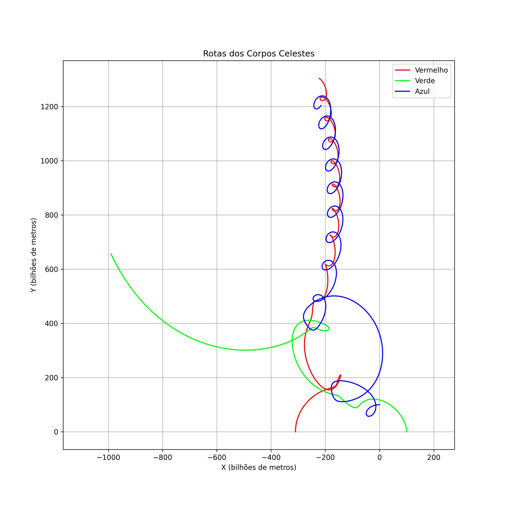

# 🌌 Simulador Gravitacional - Problema dos 3 Corpos

Este projeto implementa uma simulação visual do problema dos três corpos usando `Pygame`, com trilhas orbitais, logs automáticos e exportação de gráficos de rotas.

## 🚀 Funcionalidades

- Simulação em tempo real de corpos com gravidade newtoniana
- Visualização com zoom automático para manter todos os corpos visíveis
- Geração de **logs de posição** dos corpos a cada frame
- Salvamento de **gráfico final das rotas** ao fim da simulação (`.png`)
- Sistema de rastros orbitais para análise visual

---

## 🖥️ Requisitos

- Python 3.10 ou superior
- Módulos:
  - `pygame`
  - `matplotlib`

Instale os pacotes com:

```bash
pip install pygame matplotlib
```

## ▶️ Como executar

Clone ou baixe o repositório.

Execute o script principal:
```bash
python testeGravitacional.py
```

---

## 📜 Logs e Gráficos 


### 📝 Logs de Posição

A cada atualização da simulação, as posições de todos os corpos são salvas em um arquivo .txt localizado na pasta logs/.

Exemplo de linha de log:
67089600.00s | Azul | Pos: (-2.16e+11, 1.20e+12) | Vel: (1.75e+04, 2.53e+04) | Acel: (-2.02e-03, 2.61e-02)
Esses logs podem ser utilizados para análise posterior ou reprocessamento.

---

## 📈 Gráfico Final da Simulação

Ao final da execução, é salvo automaticamente um gráfico .png com a trilha de cada corpo:

Local: rotas/simulacao_YYYYMMDD_HHMMSS.png

Eixos em bilhões de metros

Cores correspondem às usadas na visualização do Pygame

Ideal para incluir em relatórios ou artigos científicos

Exemplo:




---
## 🎮 Controles

P - pausa a simulação.
